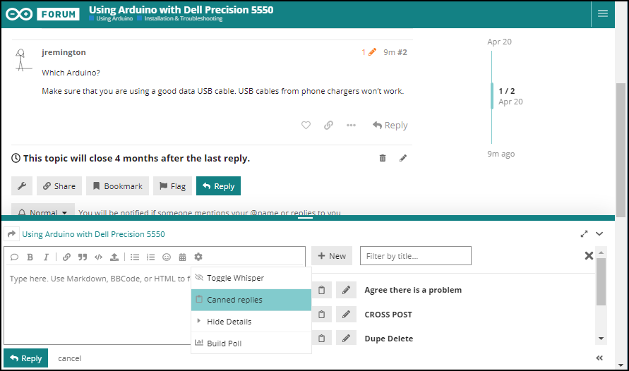

# Canned Replies

The Arduino Forum has the Discourse "Canned Replies" plugin installed:

https://www.discourse.org/plugins/canned-replies.html

This allows any staff member (moderators and administrators) to select pre-written replies from a menu in the post composer:

The Canned Replies feature is not enabled for non-staff forum members.

The same canned replies are shared between everyone. So adding or editing a canned reply affects all staff members. They can also improve consistency in [moderation procedures](../moderator-instructions/moderator-instructions.md).

For this reason, it is necessary to follow a formal process for adding or modifying Canned Replies:

1. A proposal to add, modify, or remove a Canned Reply is submitted as a [pull request](https://docs.github.com/en/github/collaborating-with-issues-and-pull-requests/about-pull-requests) against the source content in its subfolder of this folder.
1. Interested parties are given a chance to provide feedback via [the GitHub pull request review system](https://docs.github.com/en/github/collaborating-with-issues-and-pull-requests/about-pull-request-reviews).
1. Any requests for changes or objections are resolved.
1. The pull request receives [approval](https://docs.github.com/en/github/collaborating-with-issues-and-pull-requests/reviewing-proposed-changes-in-a-pull-request#submitting-your-review).
1. The pull request is merged.
1. The Canned Replies on Discourse are synced with the content of this repository.
