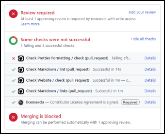

# Pull Request Guide

The development is done via a formal process that allows all interested parties the opportunity to participate in an efficient manner:

## 1. Fork

Forking a GitHub repository creates a copy of it under your account. You will stage contributions in your fork of this project.

[More information about forking repositories](https://docs.github.com/get-started/quickstart/fork-a-repo)

## 2. Branch

Create a branch in your fork to contain the changes for your contribution.

---

**ⓘ** You must make a separate branch in your fork for each pull request you submit.

---

[More information about branches](https://docs.github.com/pull-requests/collaborating-with-pull-requests/proposing-changes-to-your-work-with-pull-requests/about-branches)

## 3. Make your changes

See [the development guide](../development.md#development-guide) for more information.

## 4. Commit

Once the work on your change is complete, add it to the revision history of the Git repository by making a commit.

[More information about commits](https://git-scm.com/docs/git-commit)

## 5. Pull request

A pull request (PR) is a proposal to make a change in a repository. The repository maintainer is able to accept the changes you propose in a pull request by simply clicking a button.

[More information about pull requests](https://docs.github.com/pull-requests/collaborating-with-pull-requests/proposing-changes-to-your-work-with-pull-requests/about-pull-requests)

## 6. Resolve CI failures

Relevant checks will run automatically once you have submitted the pull request. Once these checks are finished, you can see a summary of the results near the bottom of the pull request page:

Failed checks will be indicated with an ❌. If any checks failed, please fix whatever caused it to fail. Click the "**Details**" link to the right of the check name to open the logs, which provide details about the failure.

---

**ⓘ** In some rare cases, a CI failure may be unrelated to the changes made in your pull request. So if the information in the logs doesn't seem relevant, please comment on the pull request to ask a maintainer to take a look.

---

## 7. Review

All interested parties will now have the opportunity to review the pull request. They can request changes, make general comments and discussion, or approve the pull request.

[More information about pull request reviews](https://docs.github.com/pull-requests/collaborating-with-pull-requests/reviewing-changes-in-pull-requests/about-pull-request-reviews)

## 8. Resolve change requests

To act on general review suggestions, you can add commits to the branch you submitted the pull request from, which will automatically be added to the pull request. Don't create a new pull request to act on review suggestions; update the existing pull request.

Reviewers may suggest specific changes, which can be applied by [clicking the <kbd>**Commit suggestion**</kbd> button](https://docs.github.com/pull-requests/collaborating-with-pull-requests/reviewing-changes-in-pull-requests/incorporating-feedback-in-your-pull-request#applying-suggested-changes).

## 9. Merge

One of the repository maintainers can now choose to accept your proposed change. Once the pull request is [merged](https://docs.github.com/pull-requests/collaborating-with-pull-requests/incorporating-changes-from-a-pull-request/merging-a-pull-request), you can delete the branch you created in your fork for the pull request and delete the fork as well if you like.

## 10. Publish

If the contribution modified content that is published on the Arduino Forum, a maintainer will publish the updated content.

Thanks so much for your contribution!
