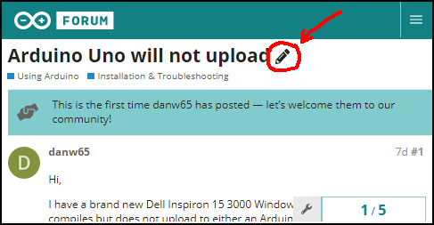
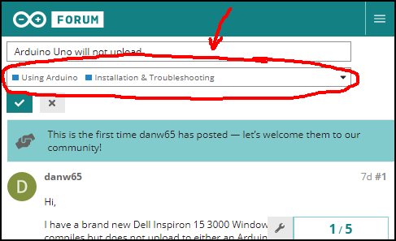
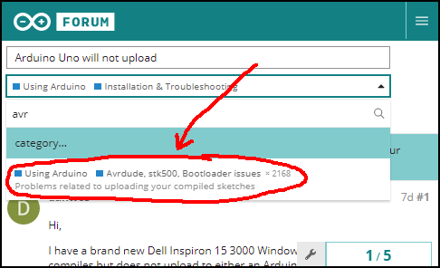
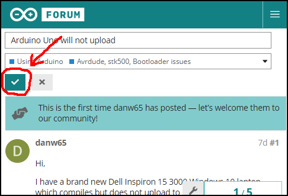

These are instructions for common moderation actions.

For general moderation guidelines, see the ["Moderator Guidelines" topic](https://forum.arduino.cc/t/moderation-guidelines/54905).

For an overview of the Discourse moderation system, see the **[Discourse Moderation Guide](https://meta.discourse.org/t/discourse-moderation-guide/63116)**.

---

### [Move topic to correct category](#move-topic)

Users often create topics in [categories](https://forum.arduino.cc/categories) which are inappropriate for the topic's subject matter.

1. Click the pencil icon ("edit the title and category of this topic") to the right of the topic title.

   

1. Click the category field, which is under the topic title field. 

   

1. Select the appropriate category from the dropdown menu. There is a convenient search feature to allow quickly finding the category you want. 

   

1. Click the **<kbd>:heavy_check_mark:</kbd>** button. 

   

---

### [Add User Note](#add-user-note)

"User Notes" provide a place for staff and automated systems to store documentation related to a user account. When a user has "User Notes", a **:memo:** icon is shown next to their user name. This icon can be clicked to view the notes.

**Note:** only moderators and administrators can see the icon and the notes. They are not visible to regular users.

Documenting inappropriate behavior or even suspicions of malicious intent (e.g., generic replies used to prepare a spam account) generates [the history](#context) that will allow moderators to determine the appropriate level of action to take in response to future [inappropriate behavior](#deal-with-inappropriate-behavior).

---

#### [User Notes specific to a post](#user-notes-specific-to-a-post)

User notes can be associated with a post. These are the same as the [User Notes general to an account](#user-notes-general-to-an-account), except that the User Note will have a button that links to the post.

1. Click the **⬤⬤⬤** icon at the bottom of the post.
1. Click the wrench icon.
1. Click **"Add User Note"**.
1. Write the User Note.
1. Click the **<kbd>Add User Note</kbd>** button.

---

#### [User Notes general to an account](#user-notes-general-to-an-account)

1. Open the user's profile page. This can be accessed by clicking their user name, then the user name in the profile preview popup.
1. Click the **<kbd>User Notes</kbd>** button. The user notes will be displayed, as well as a field for adding new notes.
1. Write the User Note.
1. Click the **<kbd>Add User Note</kbd>** button.

---

### [Adjust user Trust Level](#adjust-user-trust-level)

The user's privileges on the forum are dependent on their "Trust Level" (TL). The forum software automatically raises or lowers trust levels based on user stats. In cases where the automatically set trust level doesn't match the privileges appropriate for a user, the moderators can manually adjust the Trust Level. This can serve as a tool for putting some limits on the user's forum activity while still allowing them to participate.

Detailed information about Trust Levels: https://blog.discourse.org/2018/06/understanding-discourse-trust-levels/

1. Open the user's profile page. This can be accessed by clicking their user name, then the user name in the profile preview popup.
1. Click the **<kbd>Admin</kbd>** button.
1. From the **Permissions** section, click the **Trust Level** dropdown menu.
1. Select the desired level from the menu.
1. Click the **<kbd>:heavy_check_mark:</kbd>** button.
1. If you would like to prevent the automated adjustment of trust level by the forum software, click the **<kbd>Lock Trust Level</kbd>** button.
   If the trust level was previously locked and you want to unlock it, then click the **<kbd>Unlock Trust Level</kbd>** button.

---

### [Silence user](#silence-user)

The "Silence" action is used in cases where the intent is to temporarily curtail a user's forum activity in response to [inappropriate behavior](#deal-with-inappropriate-behavior), with the intent to later restore their privileges in hopes they can be reformed to a responsible member of the forum community.

**Note:** in cases where the intent is to permanently exclude the user from the Arduino Forum, the account should instead be ["Suspended"](#suspend-an-account).

1. Open the user's profile page. This can be accessed by clicking their user name, then the user name in the profile preview popup.
1. Click the **<kbd>Admin</kbd>** button.
1. From the **Permissions** section, click the **<kbd>Silence</kbd>** button.
1. From the **Select a timeframe** dropdown menu, select the desired duration of the silencing.
1. In the **Silence Reason** text field, enter a short explanation for the cause for the silencing.
1. Click the **<kbd>Silence</kbd>** button.

---

### [Delete spam](#delete-spam)

Note that this does not apply to legitimate advertisements of products/services that may be of interest to the Arduino community, which are allowed as long as they are posted to the "Products and Services" board.

- Open the topic.
- Open the user's forum profile page in a new tag/window (right click on user name > Open Link in New Tab or ctrl + click user name).
- If it's a spam topic, click the "Remove Topic" button. If it's a spam reply, click the "More..." button on the reply, then "Remove".
- Click the "OK" button.
- Switch to the tab/window with the user's profile page.
- Check whether the user has any other posts. If so, remove those also, following the instructions above.
- Click "Ban user". A ban is used instead of deleting the account because it prevents recreation of the account and can be undone in the event of a mistake.
- In the case of spam, you can leave the "Reason:" and "Notes:" sections blank in order to make the task of deleting spam less time consuming.
- Expiration: Never
- Restriction: Full Ban
- Triggers: Ban on Email Address, Ban on Username (note the checkboxes are ABOVE the descriptions)
- Click the "Add" button.

---

### [Investigate user](#investigate-user)

It is frequently necessary for moderators to investigate an account to determine whether moderation action is warranted, and which level of action. This might be done to determine whether:

- the user's intentions are benign or malicious (e.g., a spammer making seemingly innocent posts to prepare an account).
- the user has a history of [inappropriate behavior](#deal-with-inappropriate-behavior), which would indicate a more severe level of action is needed.
- a previous moderation action was warranted or in error in response to a report from the user of an inappropriate moderation action.

The forum software provides some useful tools for investigating a user:

#### [User Notes](#user-notes-1)

This is the tool used by staff and automated systems to store documentation related to a user account.

1. Open the user's profile page. This can be accessed by clicking their user name, then the user name in the profile preview popup.
1. Click the **<kbd>User Notes</kbd>** button.

#### [User activity](#user-activity)

This shows the user's posts, which can be used to find unreported inappropriate behavior (e.g., cross-posting, spam).

1. Open the user's profile page. This can be accessed by clicking their user name, then the user name in the profile preview popup.
   - If any of their posts have been deleted, there will be a black bar at the top of the user profile "Summary" page with a **"deleted posts"** link. Click that link to see the deleted posts.
   - Click the **"Activity"** tab to see their other posts.

#### [IP Lookup](#ip-lookup)

This tool allows you to see all the accounts associated with the user's [IP address](https://en.wikipedia.org/wiki/IP_address), which can be used to determine whether the user has other accounts (e.g., circumventing a [suspension](#suspend-an-account), [sock puppets](https://en.wikipedia.org/wiki/Sock_puppet_account)).

1. Open the user's profile page. This can be accessed by clicking their user name, then the user name in the profile preview popup.
1. Click the **<kbd>Admin</kbd>** button.
1. Click the **<kbd>:globe_with_meridians: IP Lookup</kbd>** button.
1. Check whether any other accounts are listed under the **"Other accounts with this IP address"** section.

#### [Action Logs](#action-logs)

This shows all staff actions that affected the user's account. The [User Notes](#user-notes-1) will generally contain entries for all important actions, as well as manually added notes, so check User Notes first.

1. Open the user's profile page. This can be accessed by clicking their user name, then the user name in the profile preview popup.
1. Click the **<kbd>Admin</kbd>** button.
1. Click the **<kbd>Action Logs</kbd>** button.

---

### [Move to correct language category](#move-to-correct-language-category)

The Arduino Forum has [dedicated categories for several common non-English languages](https://forum.arduino.cc/c/international/10). When a topic written in one of these languages is created in one of the English language categories of the forum, it should be moved to the appropriate language category. Some of the language categories have subject-specific subcategories which should be used when appropriate.

Topics written in a language for which there is not a dedicated board may be left in the appropriate English language board.

1. If you don't know the language or, in the case of language categories with sub-categories, subject, copy the post text and paste it into [Google Translate](https://translate.google.com). This will detect the language and allow you to determine the subject matter.
   **Note:** it's easy for someone unfamiliar with the language to mistake Portuguese for Spanish.
1. Follow the **["Move topic to correct category" instructions](#move-topic)** to move the topic to the appropriate category.

---

### [Deal with cross-post](#cross-post)

A cross-post is when a user posts on the same subject to the forum multiple times. This is harmful because it can lead to wasting the time of people trying to help by unknowingly duplicating the efforts that were made previously in reply to another instance of the cross-post.

- Open the cross-posting user's forum profile page by clicking on their user name.
- Click "Show Posts".
- Open all cross-posts.
- Pick one cross-post to keep. If only one cross-post has valuable replies, keep that one. The cross-post that is in the appropriate forum board has preference.

If a cross-post has no replies, you can delete it. If it's a topic, click the "Remove Topic" button. If it's a reply, click the "More..." button on the reply, then "Remove".

If multiple cross-posts have valuable replies, they must be merged into a single topic:

- If one of the cross-posts with valuable replies is a thread hijack, split it and the replies into a separate topic.
- Click the "Merge Topics" button. Note that the forum software will order the posts of the merged topic according to chronological order, so it doesn't make a difference which topic is merged to the other.
- The forum's merge system is very inconvenient and partly broken. You can't select a different board because this just results in an error. There is a list of topics in the same board, but this doesn't help if the merge target is in another board, or was not recently created. Defying all common sense, you need to click the "?" button on the left of the topic on the list to select it as the merge topic. The seemingly useful "ID of target topic:" input field doesn't work. So a bit of a hack is required to easily merge to any topic:
- Right click on any of the "?" buttons on the topic list. It doesn't matter which topic you choose.
- Click "Copy Link Location".
- Paste the copied link to the browser's URL bar.
- Open the topic you want to merge to in a separate tab/window.
- Copy the topic ID. This is the number after "topic=" from the topic's URL, leaving off the part after the ".".
- Switch back to the merge page.
- Replace the topic ID in the URL after "to=" with the topic ID of the target topic.
- Press Enter to load the URL.
- Uncheck "Change the subject of all the messages". Merged threads may be a bit confusing to read so having the original subjects may provide a useful clue to the original sequence of the separate discussions.
- Click the "Merge Topics" button.

Issue a warning to allow all moderators to track the history of the user's violations:

- At the bottom of the cross-posting user's post, click "More...".
- Click "Issue Warning".
- Set "Warning Level" to 20%. This will cause a "Watched" icon to appear (to moderators only) on all the user's posts, as well as a note on their forum profile page.
- Reason for Warning: "Cross-posting"
- Check the "Previous Warnings" section at the bottom of the page to see whether the user has cross-posted previously.
- Click the "Issue Warning" button.

If this is the first time the user has cross-posted, just leave a reply to notify them it is against the rules and warn them that further cross posting will result in a ban:

> I've deleted/merged your other cross-post(s).
>
> Cross-posting is against the rules of the forum. The reason is that duplicate posts can waste the time of the people trying to help. Someone might spend 15 minutes (or more) writing a detailed answer on this topic, without knowing that someone else already did the same in the other topic.
>
> Repeated cross-posting will result in a suspension from the forum.
>
> In the future, please take some time to pick the forum board that best suits the topic of your question and then only post once to that forum board. This is basic forum etiquette, as explained in the sticky "[How to use this forum - please read.](https://forum.arduino.cc/t/how-to-use-this-forum-please-read/145337)" post you will find at the top of every forum board. It contains a lot of other useful information. Please read it.
>
> Thanks in advance for your cooperation.

If the user has previously been warned not to cross-post, they should receive a ban:

- Click "More..." at the bottom of the user's post.
- Click "Ban user".
- Reason: "Cross-posting".
- If this is the first or second ban, click the radio button ABOVE "Ban will expire after". If it is the third ban, click the radio button ABOVE "Never".
- For the first ban, set "day(s)" to 3 (note the input field is ABOVE "day(s)"). For the second ban, set "day(s)" to 7.
- Triggers: Ban on Email Address, Ban on Username (note the checkboxes are ABOVE the descriptions)
- On the topic, leave a reply to explain that the user has received a ban:

> Due to continuing to cross-post after having been warned not to, OP has received a 3 day ban.

OR

> Due to continuing to cross-post after having been warned not to, OP has received a 7 day ban.

OR

> Due to continuing to cross-post after having been warned not to, OP has received a permanent ban.

---

### [Split hijacked topic](#hijack)

A topic hijack is when a user makes a reply that is not relevant to the topic. This can either result in a confusing thread where there are multiple parallel discussions, or else one of the people needing help being forgotten about. Note that a relevant reply to an old topic is NOT considered a hijack.

- On the hijack reply, click "More...".
- Click "Split Topic".
- Enter an appropriate subject for the new topic in the "Subject For New Topic" field.

If there have been no replies to the hijack reply, or all replies have been to the hijack reply (none to the original post), then we can just do a simple split:

- Click the radio button ABOVE "Split topic after and including this post."
- Click the "Split Topic" button.

If there have been replies to both the hijack reply and the original post, then we must do a selective split:

- Click the radio button ABOVE "Select posts to split."
- Click the "Split Topic" button.
- Click the arrow button on all replies you want to split to a new topic.
- Click the "Split Topic" button.

On the new topic, leave a reply to warn the user not to hijack topics:

> Please don't hijack topics! I've had to split your post out to its own topic.
>
> This is basic forum etiquette, as explained in the sticky "[How to use this forum - please read.](https://forum.arduino.cc/t/how-to-use-this-forum-please-read/145337)" post you will find at the top of every forum board. It contains a lot of other useful information. Please read it.
>
> Thanks in advance for your cooperation.

---

### [Resolve report](#resolve-report)

Forum users may assist the moderators by reporting inappropriate posts. A list of open reports are shown in the [Moderate > Reported Posts area](https://forum.arduino.cc/review). If you delete the offending topic or post to resolve the report, it will be automatically closed. Otherwise, please click the "Close" button on the report after you have resolved it (or determined that no action is required) so it will be removed from the list of open reports. If you are unsure of how to resolve the report, feel free to leave it for another moderator to deal with.

---

### [Reopen auto-closed topic](#reopen-auto-closed-topic)

When four months have passed since the last reply to a topic, it is automatically closed and non-staff forum users are prevented from replying. Forum users may request topics be unlocked by raising a "Something Else" flag against the topic.

When a reopen request flag is received, it should be reviewed to determine whether reopening the topic would be appropriate.

#### If reopening is appropriate

1. Click the topic title at the top of the flag message to open the topic in question.
1. Click the wrench button ("topic actions") at the bottom of the topic.
1. From the menu, select "**:unlock: Open Topic**".
1. Go back to [the flag review page](https://forum.arduino.cc/review).
1. Click the <kbd>**view full conversation**</kbd> button on the flag message.
1. Click the <kbd>**Reply**</kbd> button.
1. Add a message to inform the flagger that the topic was opened:
   > The topic has now been reopened.
1. Click the <kbd>**:email: Message**</kbd> button.
1. Go back to [the flag review page](https://forum.arduino.cc/review).
1. Click the <kbd>**Ignore**</kbd> button on the flag message.
   **Note:** the <kbd>**:+1: Agree...**</kbd> button should not be used because this would result in an unwarranted strike against the topic author.

#### If reopening is not appropriate

1. Click the <kbd>**view full conversation**</kbd> button on the flag message.
1. Click the <kbd>**Reply**</kbd> button.
1. Add a message to inform the flagger that the topic will not be reopened:
   > We have decided to leave the topic closed. Please [create a new topic](https://forum.arduino.cc/t/how-to-get-the-best-out-of-this-forum/679966#first-post).
1. Click the <kbd>**:email: Message**</kbd> button.
1. Go back to [the flag review page](https://forum.arduino.cc/review).
1. Click the <kbd>**:-1: Disagree**</kbd> button.

---

### [Resources](#resources)

Some additional information relevant to forum moderator procedures:

- Glossary of terms: https://meta.discourse.org/t/discourse-new-user-guide/96331#basic-terms-used-by-discourse-nomenclature
- Explanation of Trust Levels (TL): https://blog.discourse.org/2018/06/understanding-discourse-trust-levels/
- Video about handling flags: https://meta.discourse.org/t/video-how-to-moderate-posts/136440

---

### [Feedback and discussion](#feedback-and-discussion)

Please use the forum topic at the link below for discussion of this content:
<https://forum.arduino.cc/t/discussion-re-moderator-documentation-content/852461>
